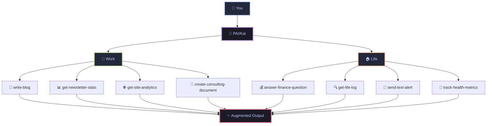
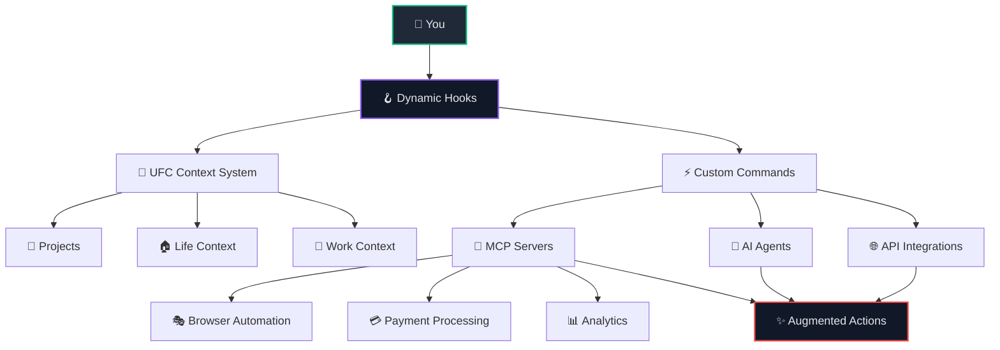

[](https://mseep.ai/app/danielmiessler-pai)

<div align="center">

<picture>
  <source media="(prefers-color-scheme: dark)" srcset="./pai-logo.png">
  <source media="(prefers-color-scheme: light)" srcset="./pai-logo.png">
  
</picture>

# **PAI** - Personal AI Infrastructure
**(Pronounced "pie" 🥧)**

### **Open-source personal AI infrastructure for orchestrating your life and work**

<br/>


[](https://opensource.org/licenses/MIT)
[](https://claude.ai/code)
[](https://youtu.be/iKwRWwabkEc)

<br/>

[](https://github.com/danielmiessler/PAI/stargazers)
[](https://github.com/danielmiessler/PAI/network/members)
[](https://github.com/danielmiessler/PAI/issues)

<br/>

**[Features](#-key-features)** • **[Quick Start](#-quick-start)** • **[Documentation](#-documentation)** • **[Examples](#-examples)** • **[Community](#-community)**

</div>

---

## 🚀 **Recent Updates**

> [!TIP]
> **[🎉 v0.2.3 Released!](https://github.com/danielmiessler/PAI/releases/tag/v0.2.3)** - Complete Visibility & Portability Update

<details open>
<summary><strong>📅 October 2, 2025 - Voice System Update</strong></summary>

- 🎙️ **Zero-Cost Voice System**: Migrated from ElevenLabs API to macOS native Premium/Enhanced voices
- 💰 **No API Costs**: 100% offline voice synthesis using built-in macOS neural TTS
- 🔊 **High-Quality Voices**: Uses Premium voices (Jamie, Ava, Serena, Isha) and Enhanced voices (Tom, Oliver, Samantha)
- 🔒 **Complete Privacy**: All voice processing happens locally, no cloud services
- ⚙️ **Centralized Config**: Voice settings managed via `voices.json` configuration file
- 🚀 **Browser Tools Update**: Switched from Playwright to Chrome DevTools MCP for web automation

</details>

<details>
<summary><strong>📅 September 28, 2025 - Complete Visibility & Portability Update (v0.2.3)</strong></summary>

- 📁 **Directory Renamed**: `.claude` → `PAI_DIRECTORY` for better visibility
- 🌍 **Vendor Agnostic**: Works with any AI vendor (Claude, GPT, Gemini, etc.)
- 👁️ **No More Hidden Files**:
  - `.zshrc` → `zshrc-aliases`
  - `.env-example` → `env-example`
- 🔧 **Dynamic Paths**: All hardcoded paths replaced with `${PAI_DIR}`
- 📍 **Consistent Config**: `.env` now lives in `${PAI_DIR}/.env`
- 🐛 **Issues Fixed**: #20 (env location) and #21 (hardcoded paths)
- ✅ **Full Portability**: Install PAI anywhere, everything just works

</details>

<details>
<summary><strong>📅 September 26, 2025 - Hooks System Update</strong></summary>

- 🪝 **Hooks Sanitized**: Updated all hook files to be public-ready with no sensitive data
- 🔧 **Path Portability**: All hooks now use `${PAI_DIR}` variable for installation-agnostic paths
- 🎯 **Session Management**: Updated session-start-hook for proper initialization
- 🎙️ **Voice Integration**: Enhanced stop-hook with intelligent voice responses and tab titles
- 📝 **Subagent Support**: Improved subagent-stop-hook for agent-specific voice notifications
- 🔌 **Dynamic Loading**: Updated load-dynamic-requirements wrapper for proper context loading
- 🚀 **Ready for Distribution**: All hooks verified clean and ready for public PAI distribution

</details>

<details>
<summary><strong>📅 September 25, 2025 - Voice Output Format & Bug Fix</strong></summary>

- 🎯 **Mandatory Format**: Enforced structured response format for voice integration
- 🔊 **Voice System**: Fixed voice notification system breaking due to inconsistent output
- 🐛 **Field Name Fix**: Fixed stop-hook.ts sending wrong field names (`text`/`voiceId` → `message`/`voice_id`)
- 📋 **Response Structure**: All responses now use mandatory emoji headers with COMPLETED line
- 🪝 **Hook Integration**: COMPLETED line properly triggers voice notifications with correct field names
- ⚡ **Consistency**: Format applies to all responses, even simple answers
- 📝 **Documentation**: Added comprehensive voice-system.md documentation
- 📝 **Context Updates**: Updated both local and PAI CLAUDE.md files with strict enforcement

</details>

<details>
<summary><strong>📅 September 24, 2025 - DA Environment Variable</strong></summary>

- 🤖 **DA Variable**: Separated Digital Assistant name and color configuration
- 🎨 **DA_COLOR Variable**: Color now configurable via `DA_COLOR` environment variable
- 📝 **Clean Separation**: `DA` handles the name, `DA_COLOR` handles the display color
- 🎨 **Color Options**: purple (default), blue, green, cyan, magenta, yellow, red, orange
- ⚙️ **Configuration**: Add to `.zshrc`:
  ```bash
  export DA="YourAssistantName"    # Defaults to "Assistant"
  export DA_COLOR="purple"         # Choose your color
  ```

</details>

<details>
<summary><strong>📅 September 22, 2025 - v0.2 Release</strong></summary>

- 🔗 **Human 3.0**: Added link to projects fit together blog post
- 📊 **Badges**: Fixed purple color and stats display issues
- 📝 **Documentation**: Improved table formatting and structure
- ✨ **Polish**: Enhanced README readability and navigation
- 🔧 **Fixes**: Minor formatting and display improvements

</details>

<details>
<summary><strong>📅 September 21, 2025 - v0.1 Release</strong></summary>

- 🎉 **Release**: Published v0.1 - Initial public release
- 🔒 **Voice**: Hardened the voice server
- 🏠 **Portability**: PAI_HOME support eliminates hardcoded paths
- 📚 **Docs**: Comprehensive documentation under `${PAI_DIR}/documentation/`
- 🔌 **Dynamic**: MCP detection via `settings.json`
- 🏗️ **Architecture**: Complete system documentation with examples

</details>

<details>
<summary><strong>📅 Previous Updates</strong></summary>

**September 20, 2025**
- 🗣️ Added `/voice-server` with ElevenLabs integration
- 🔧 Fixed hardcoded path issues
- 🪝 Working on missing hooks

**September 12, 2025**  
- 🧠 Dynamic resource loading system
- ⚡ Submit-user-hook for context loading
- 🗺️ Dynamic routing via load-dynamic-requirements

</details>

---

## 🎯 **What is PAI?**

> **Core Mission:** Augment humans with AI capabilities so they can survive and thrive in a world full of AI.

### 🌍 **The Problem**

**It doesn't matter how powerful AI becomes if it's not in the hands of everyone on Earth.**

Right now, AI is trapped behind corporate APIs, expensive subscriptions, and complex interfaces that only developers can use. Meanwhile, billions of people who could benefit from AI augmentation—artists, teachers, small business owners, researchers, parents—are left behind.

PAI exists to solve this. This project's goal is to give the most powerful AI capabilities, in the form of a complete platform, to everyone on Earth. Not just the tech elite. Not just the wealthy. Everyone.

<div align="center">



</div>

**PAI is an open-source, full personal AI platform that's completely agnostic to who you are and what you're trying to accomplish.**

Think of PAI as your personal AI that actually knows you—all your projects, your style, your data—and can handle anything you throw at it. Whether you're an artist transitioning to independence, a founder building a company, or someone managing complex health needs, PAI becomes whatever you need it to be.

PAI is part of the journey toward Human 3.0—where humans are augmented by AI to amplify their capabilities.

📖 **[Learn how PAI fits into the Human 3.0 vision](https://danielmiessler.com/blog/how-my-projects-fit-together)**

<table>
<tr>
<td width="33%" valign="top">

### 🧠 **Life Management**

**Finance Intelligence**
- `answer-finance-question` - Analyze bank statements
- `get-finances-state` - Track spending patterns
- Parse PDFs for utility bills and expenses

**Memory & Conversations**
- `get-life-log` - Search recorded meetings
- Query Limitless.ai pendant recordings
- Find what was discussed at any event

**Health Tracking**
- Monitor wellness metrics
- Track medical records
- Analyze sleep and fitness data

</td>
<td width="33%" valign="top">

### 💼 **Professional**

**Content Creation**
- `write-blog` - Generate posts in your style
- `publish-blog` - Deploy to production
- `enhance-content` - Improve existing work

**Business Analytics**
- `get-newsletter-stats` - Beehiiv metrics
- `get-site-analytics` - Website performance
- `create-consulting-document` - Client deliverables

**Development**
- `design-review` - Code analysis
- `browser-tools-setup` - Automation
- `update-daemon` - API management

</td>
<td width="33%" valign="top">

### 🎯 **Personal Growth**

**Knowledge Capture**
- `extract-knowledge` - Learn from content
- `capture-learning` - Document insights
- `web-research` - Deep investigations

**Communication**
- `send-email` - Automated outreach
- `send-text-alert` - SMS notifications
- `send-discord-alert` - Team updates

**Productivity**
- `add-linear-ticket` - Task management
- `create-mermaid-visualization` - Idea mapping
- `query-context` - Access any stored knowledge

</td>
</tr>
</table>

### 🌟 **Why This System is Different**

> *This system is designed from the very beginning to be available to anybody and to grow and scale with you throughout your life.*

- **🔓 Open Framework**: No vendor lock-in, complete transparency, you own everything
- **🌍 Universal**: Works for anyone, anywhere, in any profession or life situation
- **🤖 Platform Independent**: Core structure works with Claude, GPT, Gemini, or any AI platform
- **🧠 Persistent Memory**: Your AI remembers every context, project, and conversation
- **🎯 Task Agnostic**: From writing a blog to tracking medical data to running a business
- **📁 Plain Text**: All configuration in human-readable files you can edit and understand
- **🔌 Extensible**: Add your own commands, agents, and integrations

📖 **[Read the full technical deep-dive on PAI](https://danielmiessler.com/blog/personal-ai-infrastructure)**

---

## ⚡ **Architecture**

### 🏗️ **The PAI System Architecture**



### 📁 **UFC Context System**

<table>
<tr>
<td width="50%">

```
${PAI_DIR}/context/
├── projects/
│   ├── website/
│   ├── Alma/
│   └── PAI/
├── life/
│   ├── finances/
│   ├── health/
│   └── expenses/
├── work/
│   ├── consulting/
│   └── business/
└── benefits/
    └── credit-cards/
```

</td>
<td width="50%">

**Features:**
- ✅ Persistent memory across sessions
- 📄 Plain text files - human readable
- ⚡ Dynamic loading based on context
- 📂 Hierarchical organization

</td>
</tr>
</table>

### ⚡ **Custom Commands**

> [!NOTE]
> **These are examples from my setup. Your PAI will have completely different commands based on YOUR unique needs. The possibilities are infinite!**

<table>
<tr>
<td width="50%">

**💼 Professional:**
- `write-blog` - Content generation
- `get-newsletter-stats` - Beehiiv metrics  
- `design-review` - Code analysis
- `create-consulting-document` - Client docs
- `update-daemon` - API management

</td>
<td width="50%">

**🏠 Personal:**
- `answer-finance-question` - Financial insights
- `get-life-log` - Limitless.ai integration
- `send-text-alert` - SMS notifications
- `track-health-metrics` - Wellness tracking
- `capture-learning` - Knowledge capture

</td>
</tr>
</table>

**🚀 60+ commands** ready to use out of the box

### 🤖 **Specialized Agents**

> [!IMPORTANT]
> **These agents are examples. You'll create your own specialized agents for YOUR specific workflows - artists might have creative agents, doctors might have diagnostic agents, teachers might have curriculum agents. The system adapts to YOU.**

| Agent | Purpose | Tools | Use Case |
|:------|:--------|:------|:---------|
| **🔍 Researcher** | Deep web research | WebSearch, WebFetch | Information gathering |
| **⚙️ Engineer** | Production code | Testing, Debugging | Software development |
| **🎨 Designer** | UX/UI design | Figma, shadcn/ui | Interface creation |
| **🔒 Pentester** | Security testing | Nmap, Burp | Vulnerability assessment |
| **🏗️ Architect** | System design | Diagrams, PRDs | Technical planning |

**Enhanced with:**
- 🎙️ ElevenLabs voice synthesis
- ⚡ Task parallelization
- 🔌 Deep tool integration

### 🪝 **Dynamic Hook System**

<table>
<tr>
<td width="50%">

**📥 Context Loading Hooks:**
- `submit-user-hook` - Loads context by intent
- `load-dynamic-requirements` - Smart routing
- Automatic agent selection
- Domain-specific knowledge injection

</td>
<td width="50%">

**🔧 Integration Hooks:**
- Pre/post command execution
- Error handling and recovery  
- Rate limiting and validation
- Security scanning

</td>
</tr>
</table>

### 🔌 **MCP Server Ecosystem**

<table>
<tr>
<td>

**🌐 Browser & Testing**
- Playwright automation
- Puppeteer control
- Selenium testing
- Visual regression

</td>
<td>

**💳 Financial**  
- Stripe API
- Square payments
- PayPal integration
- Crypto wallets

</td>
<td>

**📊 Analytics**
- Google Analytics
- Mixpanel tracking
- Beehiiv stats
- Site metrics

</td>
<td>

**💬 Communication**
- ElevenLabs TTS
- OpenAI Voice
- Discord bots
- Email/SMS

</td>
</tr>
</table>

---

## 🚀 **Quick Start**

> [!NOTE]
> PAI was originally built with [Claude Code](https://claude.ai/code), but the architecture supports any AI platform (GPT, Gemini, etc.)
> Requires [Bun](https://bun.sh) JavaScript runtime for the current implementation.

### **Installation**

#### **Step 1: Install Prerequisites**

```bash
# Install Bun (JavaScript runtime)
brew install oven-sh/bun/bun 

# Get Claude Code (AI interface)
# Visit: https://claude.ai/code
```

#### **Step 2: Clone PAI Repository**

```bash
# Clone the PAI repository
git clone https://github.com/danielmiessler/PAI.git
cd PAI

# Note: PAI_DIRECTORY is now visible by default
ls -la  # See all files including PAI_DIRECTORY
```

#### **Step 3: Configure PAI Directory Variable** ⚠️ **IMPORTANT**

> [!IMPORTANT]
> **You MUST configure the PAI_DIR variable to point to your PAI installation directory.**
> This makes the PAI system completely agnostic to your installation location.

```bash
# Add to your shell config (~/.zshrc or ~/.bashrc)
# Replace /path/to/PAI with YOUR actual PAI installation path
export PAI_DIR="/path/to/PAI/PAI_DIRECTORY"  # Point to the PAI_DIRECTORY in your PAI installation
export PAI_HOME="$HOME"  # Your home directory

# Example (adjust to YOUR installation path):
# export PAI_DIR="$HOME/Projects/PAI/PAI_DIRECTORY"
# export PAI_DIR="$HOME/Documents/PAI/PAI_DIRECTORY"
# export PAI_DIR="/Users/yourname/PAI/PAI_DIRECTORY"

# Reload your shell configuration
source ~/.zshrc  # or source ~/.bashrc
```

#### **Step 4: Configure Environment**

```bash
# Copy environment template to PAI_DIRECTORY
cp ${PAI_DIR}/env-example ${PAI_DIR}/.env

# Add your API keys (optional)
vim ${PAI_DIR}/.env
# Add: OPENAI_API_KEY="your_key_here" (if using GPT integration)
```

#### **Step 5: Launch PAI**

```bash
# Navigate to PAI directory
cd ${PAI_DIR}

# Optional: Set up voice notifications (macOS only)
# Download Premium/Enhanced voices from System Settings → Voice (Live Speech)
# Then start the voice server:
cd voice-server && bun server.ts &
# See documentation/VOICE-SETUP-GUIDE.md for detailed setup instructions

# Open Claude Code and start using PAI!
# Your personal AI infrastructure is ready 🚀
```

### **⚙️ Environment Variables**

```bash
# Required - MUST be configured for PAI to work properly
PAI_DIR="/path/to/PAI/PAI_DIRECTORY"    # PAI's PAI_DIRECTORY (system agnostic)
PAI_HOME="$HOME"                  # Your home directory

# Optional API Keys
OPENAI_API_KEY="your_key"         # GPT integration (optional)
PORT="8888"                        # Voice server port (default: 8888)

# Digital Assistant Customization
DA="YourAssistantName"            # Your AI assistant's name (default: "Assistant")
DA_COLOR="purple"                 # Display color (purple, blue, green, cyan, etc.)
```

> [!TIP]
> **Why PAI_DIR is Important:** The PAI_DIR variable makes the entire PAI system portable and installation-agnostic. All commands, contexts, and hooks reference `${PAI_DIR}` instead of hardcoded paths. This means you can install PAI anywhere on your system, and as long as PAI_DIR points to your `PAI_DIRECTORY`, everything will work seamlessly.

---

## 📚 **Documentation**

<div align="center">

| 📖 Guide | 🎯 Purpose | ⏱️ Time |
|----------|------------|---------|
| [Quick Start](#-quick-start) | Get up and running | 5 min |
| [Architecture](#-architecture) | Understand the system | 10 min |
| [SECURITY.md](./SECURITY.md) | Security guidelines | 5 min |
| [Voice Server](./PAI_DIRECTORY/voice-server/README.md) | Enable voice interaction | 10 min |
| [Commands Directory](./PAI_DIRECTORY/commands/) | Browse all commands | 15 min |

</div>

---

## 🎬 **Real-World Examples**

<div align="center">

> [!IMPORTANT]
> **These are examples from my personal PAI setup. Your system will have completely different commands based on YOUR unique needs, workflows, and goals. The beauty of PAI is that it becomes whatever YOU need it to be.**

</div>

<table>
<tr>
<td width="33%" valign="top">

### 💼 **Professional**

#### 📈 **Business & Analytics**

<details>
<summary><strong>📊 Newsletter Performance</strong></summary>

```bash
# Track newsletter metrics in real-time
get-newsletter-stats
# Returns subscriber growth, open rates, top content
```

</details>

<details>
<summary><strong>🚀 Startup Dashboard</strong></summary>

```bash
# Monitor all key metrics
get-site-analytics        # Traffic and conversions
get-finances-state        # Revenue tracking
add-linear-ticket         # Development velocity
```

</details>

#### 🔒 **Development & Security**

<details>
<summary><strong>🔍 Code Security</strong></summary>

```bash
# Security automation
check-for-sensitive --scan all
design-review --security-focus
browser-tools-setup --headers
```

</details>

<details>
<summary><strong>🔌 API Infrastructure</strong></summary>

```bash
# Personal API management
update-daemon --endpoints
create-cloudflare-mcp-server
update-tools-context --integrations
startup-context-load
```

</details>

#### ✍️ **Content Creation**

<details>
<summary><strong>📝 Blog Pipeline</strong></summary>

```bash
# End-to-end content creation
web-research "emerging AI trends"
extract-knowledge --key-points
write-blog --style personal --length 1500
enhance-content --seo --readability
publish-blog --schedule tomorrow
```

</details>

<details>
<summary><strong>🎨 Visual Content</strong></summary>

```bash
# Create stunning visualizations
create-d3-visualization --data metrics.json
create-custom-image "futuristic AI assistant"
create-mermaid-visualization --type flowchart
```

</details>

</td>
<td width="33%" valign="top">

### 🏠 **Personal**

#### 💰 **Financial Intelligence**

<details>
<summary><strong>📉 Expense Analysis</strong></summary>

```bash
# Instant financial insights
answer-finance-question "monthly utilities average?"
answer-finance-question "subscription spending?"
process-finances-data --categorize --visualize
```

</details>

<details>
<summary><strong>📈 Financial Planning</strong></summary>

```bash
# Comprehensive financial overview
get-finances-state
prepare-finances-dashboard
push-finances-state --notify
```

</details>

#### 🧪 **Memory & Research**

<details>
<summary><strong>🔍 Meeting Recall</strong></summary>

```bash
# Never forget a conversation
get-life-log "investor meeting last week"
get-life-log "product roadmap decisions"
query-context "action items from standup"
```

</details>

<details>
<summary><strong>📚 Knowledge Building</strong></summary>

```bash
# Build your second brain
capture-learning --source conference
extract-knowledge --summarize
learn-from-iterations --improve
query-context "machine learning notes"
```

</details>

#### 🎯 **Personal Productivity**

<details>
<summary><strong>툿 Morning Automation</strong></summary>

```bash
# Start your day right
get-life-log "yesterday's highlights"
query-context "today's priorities"
send-text-alert "heading to office"
reset-visitor-peak  # Reset daily counters
```

</details>

<details>
<summary><strong>📧 Smart Communication</strong></summary>

```bash
# Intelligent outreach
send-email --template followup
send-discord-alert --channel team
add-links --resource documentation
update-public-content
```

</details>

</td>
<td width="33%" valign="top">

### 🎨 **Creative & Other Fields**

#### 🎭 **Artist Workflow**

<details>
<summary><strong>🎨 Creative Portfolio</strong></summary>

```bash
# Manage artistic work
track-project-progress "oil painting series"
generate-artist-statement --style contemporary
update-portfolio-website --new-pieces
schedule-gallery-submission --deadline friday
```

</details>

<details>
<summary><strong>📷 Photography Business</strong></summary>

```bash
# End-to-end photography workflow
process-shoot-metadata --wedding-2024-09
generate-client-gallery --password-protected
send-invoice --client johnson-wedding
backup-raw-files --cloud-storage
```

</details>

#### 🎵 **Musician Setup**

<details>
<summary><strong>🎤 Music Production</strong></summary>

```bash
# Creative music workflow
track-song-ideas --voice-memo-to-text
generate-chord-progressions --key-of-c
schedule-studio-time --next-available
export-stems --for-mixing
```

</details>

#### 🌿 **Health & Wellness Coach**

<details>
<summary><strong>🏋️ Client Management</strong></summary>

```bash
# Wellness practice automation
track-client-progress --weekly-checkin
generate-meal-plans --dietary-restrictions
send-motivation-message --personalized
schedule-follow-up --in-two-weeks
```

</details>

#### 📚 **Academic Researcher**

<details>
<summary><strong>🔬 Research Pipeline</strong></summary>

```bash
# Academic workflow
search-literature --keywords "machine learning ethics"
organize-citations --zotero-import
generate-literature-review --outline
track-experiment-results --statistical-analysis
```

</details>

#### 🏠 **Real Estate Agent**

<details>
<summary><strong>🏡 Property Management</strong></summary>

```bash
# Real estate automation
analyze-market-trends --neighborhood-data
generate-property-reports --comparative-analysis
schedule-showings --calendar-optimization
send-client-updates --weekly-digest
```

</details>

</td>
</tr>
</table>

---

## 🤝 **Community**

<div align="center">

### **Help Us Give AI to the World**

<a href="https://github.com/danielmiessler/PAI/issues">
  
</a>
<a href="https://github.com/danielmiessler/PAI/discussions">
  
</a>
<a href="https://github.com/danielmiessler/PAI/pulls">
  
</a>

<br/>
<br/>

**⭐ Star this repo** to stay updated with the latest features!

</div>

---

## 📄 **License**

PAI is MIT licensed. See [LICENSE](./LICENSE) for details.

---

<div align="center">

### **The Path to Human 3.0**

> *"Humans are what matter. AI is only as useful as it is to people. A system like this is need to level the field with AI and help us get to [Human 3.0](https://danielmiessler.com/blog/how-my-projects-fit-together)."*

<br/>

**Created by [Daniel Miessler](https://danielmiessler.com)**

📧 **[Newsletter](https://newsletter.danielmiessler.com)** • 📝 **[Blog](https://danielmiessler.com/blog)** • 💼 **[LinkedIn](https://linkedin.com/in/danielmiessler)** • 🎬 **[YouTube](https://www.youtube.com/@unsupervised-learning)**

<br/>

<a href="#">
  
</a>

</div>
